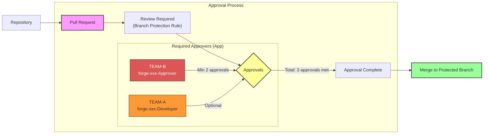
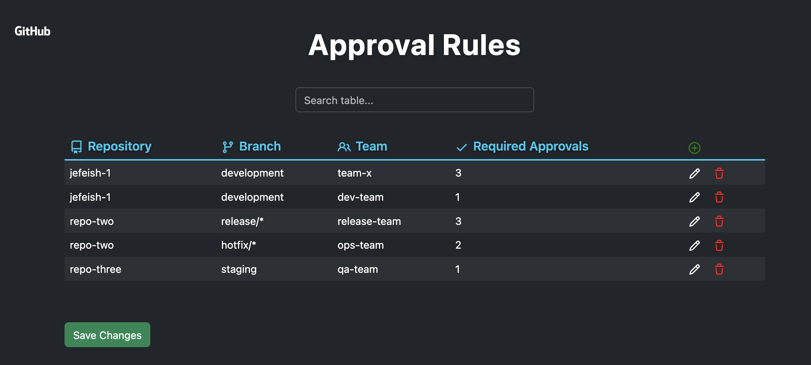

# Team Approval Checker GitHub App

A Probot-based GitHub App that enforces team-based approval rules for pull requests, configurable via a YAML file in an admin repository. The app supports multiple teams, wildcard branch patterns, and provides a web admin UI for the approval rules.

---

## Features

- Enforce required approvals from specific teams per repo/branch
- Supports wildcard branch patterns (e.g., `release/*`)
- Centralized YAML configuration in an admin repo
- Web admin UI for managing approval rules
- Probot-based, easy to deploy

---

## Overview



---

## How It Works

1. **Pull request review events** trigger the app.
2. The app loads approval rules from a YAML file in a central admin repository.
3. It matches the PR’s repo and branch (supports wildcards) to all relevant rules.
4. For each rule, it checks if the required number of approvals from the specified team is met.
5. The app can set PR status or leave comments based on the result.
6. Admins can manage rules via a web UI.

---

## Configuration

Approval rules are managed in a YAML file (example):

```yaml
repos:
  - repo_name: jefeish-1
    branch: main
    team: team-x
    required_approvals: 2
  - repo_name: repo-two
    branch: release/*
    team: release-team
    required_approvals: 3
```

---

## Admin UI Screenshot



*Above: The web admin page for managing repository approval rules.*

---

## Running Locally

1. Clone the repo and install dependencies:
   ```sh
   npm install
   ```

2. Set environment variables in `.env`:
   ```
   ADMIN_REPO_ORG=your-org
   ADMIN_REPO_NAME=your-admin-repo
   ADMIN_REPO_PATH=approval_rules.yaml
   ```

3. Start the app:
   ```sh
   npm start
   ```

4. Access the admin UI at `http://localhost:3000/app/approval-rules`

---

## License

[ISC](LICENSE) © 2025 Jürgen Efeish
